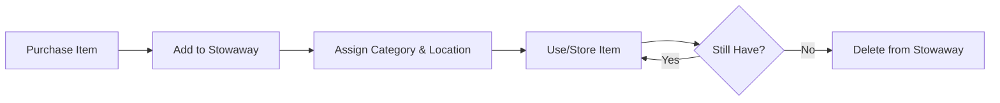

# Managing Items

This guide covers everything you need to know about managing items in Stowaway.

## Creating Items

### Basic Item

At minimum, an item needs a name:

```
Name: "Wireless Mouse"
```

### Complete Item

For full tracking capabilities, include all details:

| Field | Example Value |
|-------|---------------|
| Name | Logitech MX Master 3 |
| Description | Wireless ergonomic mouse with customizable buttons |
| Manufacturer | Logitech |
| Barcode | 097855147479 |
| Price | 99.99 |
| Buy Date | 2024-01-15 |
| Quantity | 2 |
| Min Quantity | 1 |
| Category | Electronics |
| Location | Office Desk Drawer |

---

## Item Fields Explained

### Name

The primary identifier for your item. Make it descriptive enough to recognize at a glance.

!!! tip "Naming Convention"
    Consider a consistent naming pattern:

    - `[Brand] [Product] [Variant]`
    - Example: "Apple MacBook Pro 14-inch M3"

### Description

Additional details that don't fit elsewhere:

- Specifications
- Notes about condition
- Where you bought it
- What it's used for

### Barcode

Product barcodes for scanning:

- **UPC** - 12 digits (common in USA)
- **EAN** - 13 digits (international)
- **Custom** - Your own identifier system

### Quantity & Min Quantity

Track how many you have:

- **Quantity** - Current count
- **Min Quantity** - Alert threshold

When quantity ≤ min quantity, the item appears in low stock alerts.

---

## Working with Images

### Adding Images

1. Open item in edit mode
2. Drag and drop images onto the upload area
3. Or click to browse for files

### Multiple Images

Items can have multiple images:

- First image becomes the thumbnail
- All images viewable in detail view
- Reorder by drag and drop

### Removing Images

1. Edit the item
2. Click the remove button on an image
3. Save changes

---

## Categories

### Assigning Categories

When creating or editing an item:

1. Click the Category dropdown
2. Select an existing category
3. Or create a new one inline

### Changing Categories

Reassigning is easy:

1. Edit the item
2. Select a different category
3. Save

### Removing Category

To uncategorize an item:

1. Edit the item
2. Clear the category selection
3. Save

---

## Locations

### Setting Location

Track where items are stored:

1. Edit the item
2. Select a location from the dropdown
3. Save

### Moving Items

When you physically move an item:

1. Edit the item
2. Change the location
3. Save

This keeps your digital inventory matching physical reality.

---

## Bulk Operations

### Search and Filter

Find multiple items efficiently:

```
Search: "mouse"
Filter: Category = "Electronics"
```

### Export for Analysis

Export filtered results:

1. Apply your filters
2. Click Export
3. Choose JSON or CSV
4. Download file

---

## Item Lifecycle

### Typical Workflow



### Tracking Consumption

For consumable items:

1. Set initial quantity
2. Set min quantity threshold
3. Decrease quantity as used
4. Restock when alerted

---

## Best Practices

### Organization

- **Be consistent** - Use the same naming conventions throughout
- **Use categories** - Group similar items together
- **Track locations** - Know where everything is physically

### Data Quality

- **Add images** - Visual identification helps
- **Include barcodes** - Enable scanning features
- **Set min quantities** - Never run out unexpectedly

### Maintenance

- **Regular audits** - Verify physical counts match
- **Update locations** - Keep track of moved items
- **Clean up** - Remove items you no longer have
