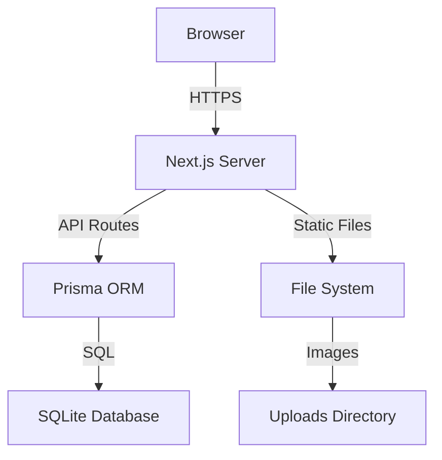

# Overview

Stowaway is a modern, self-hosted inventory management system designed for individuals and small teams who want to keep track of their belongings.

## Why Stowaway?

### Self-Hosted

Your data stays on your server. No subscriptions, no third-party access, no vendor lock-in.

### Modern Stack

Built with Next.js, Prisma, and SQLite - technologies that are fast, reliable, and easy to maintain.

### Easy to Use

A clean, intuitive interface that works on desktop and mobile devices.

---

## Core Concepts

### Items

Items are the core of Stowaway. Each item represents something you want to track:

- **Physical goods** - Tools, equipment, supplies
- **Collectibles** - Books, media, memorabilia
- **Household items** - Kitchen appliances, electronics
- **Business inventory** - Products, materials, assets

### Categories

Categories help you organize items into logical groups:

- Color-coded for visual identification
- Filter items by category
- Track item counts per category

### Locations

Locations represent where items are physically stored:

- Rooms in your home
- Shelves in a warehouse
- Storage units
- Any custom location you define

---

## Architecture

### Components

| Component | Technology | Purpose |
|-----------|------------|---------|
| Frontend | React + Next.js | User interface |
| Backend | Next.js API Routes | REST API |
| Database | SQLite + Prisma | Data persistence |
| Auth | NextAuth.js | Authentication |
| Styling | Tailwind CSS + shadcn/ui | UI components |

---

## User Roles

### Admin

- Full access to all features
- Can manage all users' items
- First registered user automatically becomes admin

### User

- Can manage their own items
- Cannot access other users' data
- Standard access to all features

---

## Data Flow

1. **User Action** - User interacts with the web interface
2. **API Request** - Browser sends request to Next.js API route
3. **Authentication** - NextAuth.js validates the session
4. **Database Query** - Prisma executes the database operation
5. **Response** - Data is returned and rendered in the UI

---

## Next Steps

- [Features](features.md) - Detailed feature documentation
- [Managing Items](items.md) - Learn how to work with items
- [API Reference](../api/index.md) - Technical API documentation
